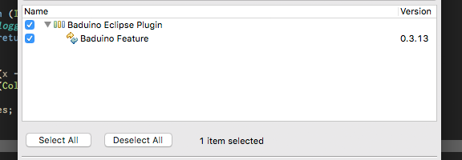
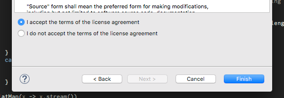

# Instalação

1. No menu do Eclipse, selecione *Help → Install New Software...*

2. Na janela *Install*, no campo *Work with*, digite `https://saeg.github.io/update-site`

3. Selecione a última versão da Baduino e clique em *Next*

4. Siga os passos do instalador.

## Requisitos
* Java 1.8
* Classes de teste com o sufixo *Test.class

Apesar de ter sido criada utilizando maven, a Baduino não requer que o projeto a ser analizado esteja nessa estrutura, pois ela vasculha o projeto e encontra todas as classes compiladas.

Para uma melhor performance na busca pelas classes, a Baduino usa a nova API Stream do Java, sendo necessária a versão 1.8 ou superior. Com isso, a Baduino é capaz de analisar qualquer projeto em qualquer estrutura, dispensando configurações complicadas.

É só clicar, executar os testes e visualizar os resultados. Simples.
